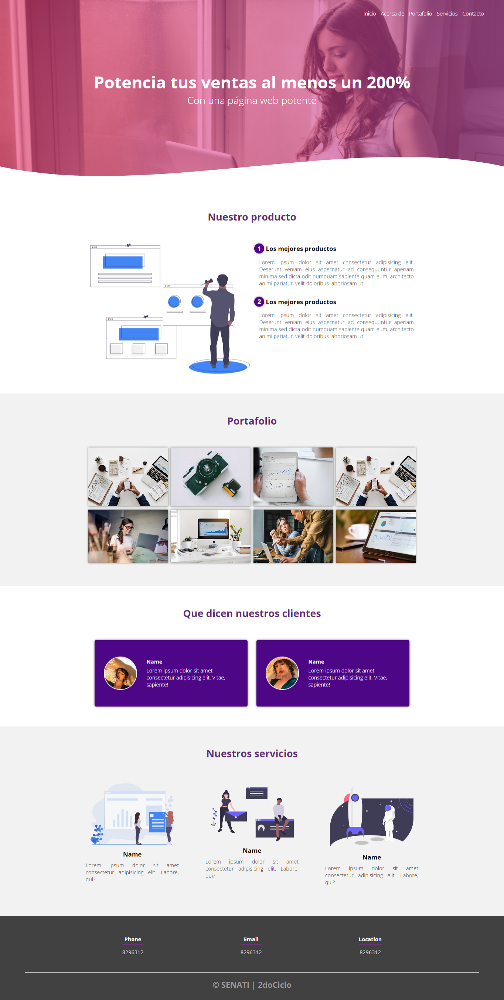

# Hackathon-2dociclo-2023
Github Action : Jekyll using Docker image
<h3>Pasos a seguir:</h3>
<h4> 1. Diseñar en Wireframe la pagina web </h4>

   ```
   https://excalidraw.com/
   ```

<h4> 2. Diseñar en Figma </h4>

   ```
   Grupo 01
   https://www.figma.com/file/moUsXJc1Gdf1elM7Unnipf/GRUPO-01?type=design&node-id=0%3A1&mode=design&t=wx7tCCXBU7ENqsw1-1
   ```

   ```
   Grupo 02
   https://www.figma.com/file/vTyTq0NxaDI8rzZC7z7FmW/GRUPO-02?type=design&node-id=0%3A1&mode=design&t=mbAmZFXRwQlhdaoW-1
   ```

 <h4> 3. Diseña tu WEB utilizando HTML - CSS (codigo puro) </h4>
 <h4> 3.1 Entra a tu GITHUB </h4>  
 <h4> 3.2 Crea tu repositorio en publico, ya sea en la organización senati o en tu mismo perfil. </h4>
 <h4> 3.3 Invita a tus programadores (colaboradores) para que te ayuden (minimo 2). </h4>
 <h4> 3.4 Empieza a trabajar colaborativamentecon el EDITOR DE TEXTO DE GITHUB en tiempo real- (Revisare los Push y los comentarios) </h4>
 
 <hr/>
 <h2>Crea un sistema de RESTAURANTE que contenga el LOGIN o INICIAR SESIÓN, tambien REGISTRO y REPORTES de "menus y empleados" utilizando PHP y MSYSQL</h4>
 <h4> 4. Diseñar Modelo Relacional de la base de datos que se llamara "restaurante_bd" </h4>
 
```
Eligir cualquiera de las dos herramientas.
https://www.drawio.com/
https://www.lucidchart.com/
```
      
 <h4> 4. Debe contener dos tablas en tu base de datos "PLATOS DE COMIDA (menu)", "EMPLEADOS"  </h4>
 <h3> TABLA platos</h3>
       
   
      CREATE TABLE plato (
          id_plato INT PRIMARY KEY AUTO_INCREMENT,
          nombre_plato VARCHAR(50) NOT NULL,
          descripcion VARCHAR(50) NOT FULL,
          precio DECIMAL(8,2) NOT NULL
      );
    

<h3> TABLA empleados</h3>
       
    
         CREATE TABLE empleados (
             id_empleado INT PRIMARY KEY AUTO_INCREMENT,
             nombre VARCHAR(50) NOT NULL,
             email VARCHAR(50) UNIQUE NOT NULL,
             password VARCHAR(50) NOT NULL
             roles VARCHAR(50) NOT NULL,
             salario DECIMAL(10,2) NOT NULL
         );

       En el "roles" iran estos datos:  ('Chef', 'Cocinero', 'Mesero', 'Cajero', 'Administrador')
    
 <h4> 5. En PHP - Utiliza el Framework Bootrastrap solo para diseñar los formularios, la tabla de reportes, el login </h4>

   ```
   https://getbootstrap.com/
   ```

 <h4> 5.1 Crea tu Base de datos en el Gestor de base de datos "MYSQL", ya estructurado anteriormente o previamente</h4>
 <h4> 5.2 Creas tus archivos de PHP y tus carpetas, trabaja en tu editor de texto mas confiable (vscode, sublime, brackets,atom)</h4>  
 <h4> 5.3 Activa tu servidor local (XAMP)</h4>
 <h4> 5.4 Empieza a codificar. </h4>
 <h4> 5.5 La sitio web del sistema debe tener estas funcionalidades que se mostraran en la pantalla respectivamente para cada ROLES. </h4>
    <ol>
       <li>Reconocer si es administrador, Chef, Cocinero, Mesero, Cajero y Administrador</li>
       <li>Si es administrador que me muestre los siguientes items</li>
            <ul>
               <li>Formulario de registro de empleados y menus</li>
               <li>Reporte de los empleados y menus</li>
            </ul>
       <li>Si es Cajero que tengas estas funcionalidades</li>
            <ul>
               <li>la parte del monto salarial de los empleados (el cajero no debe ver cuanto gana cada empleado)</li>
               <li>Que visualize el reporte de los empleados y menus</li>
               <li>Que visualize el formulario de menus</li>
            </ul>
       </li>
        <li>Si es Mesero que tengas estas funcionalidades</li>
            <ul>
               <li>Que no me muestren el formulario de registro de menus y de empleados</li>
               <li>Que no me muestren los reportes de empleados</li>
               <li>Que me muestre la tabla de reportes de menus</li>
            </ul>
       </li>
       <li>Si es 'Chef', 'Cocinero' que me visualize en la pantalla:</li>
            <ul>
               <li>Que solamente me visualize un mensaje en la pantalla: "PROXIMAMENTE NUEVAS FUNCIONALIADES EN EL SISTEMA"</li>
            </ul>
       </li>
    </ol>
    
<hr>
<h2> IMAGEN DE LA PAGINA WEB</h2>


